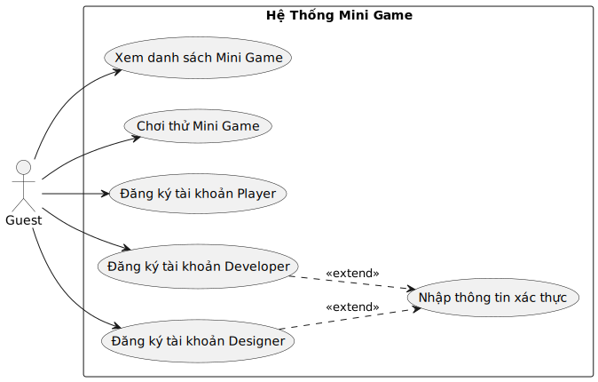
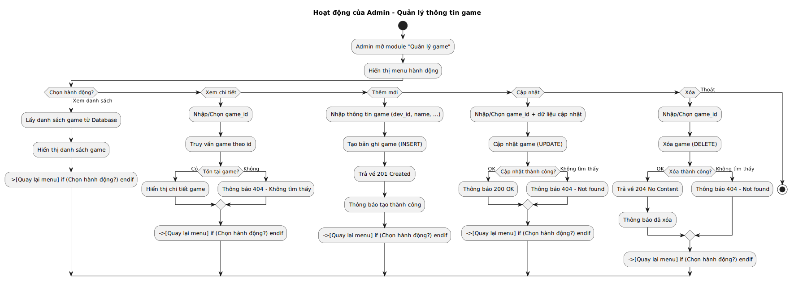
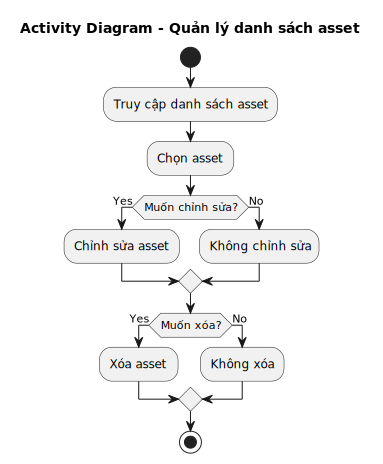
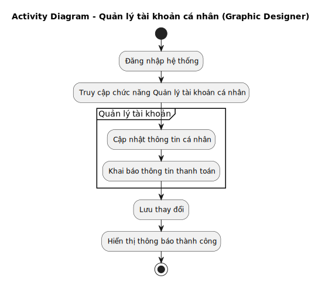
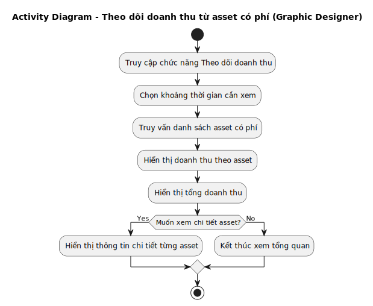
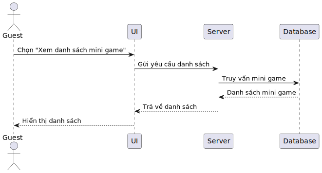
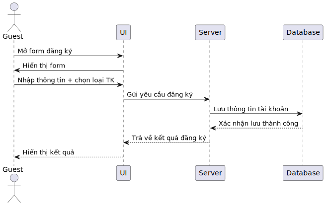
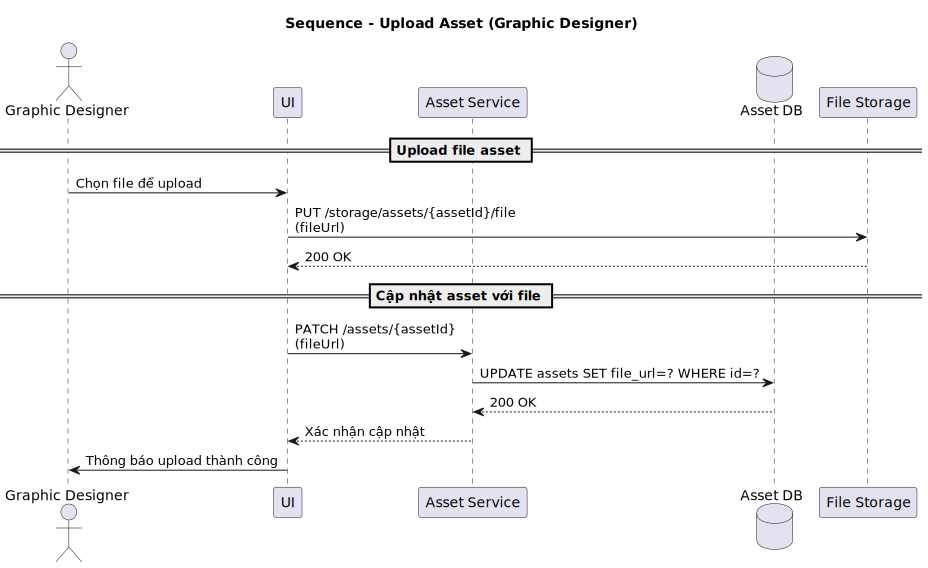

# TÀI LIỆU DỰ ÁN

## Sơ đồ tác nhân

## UseCase 

### Chức năng Guest

### Chức năng Player

### Chức năng Developer

### Chức năng Admin

### Chức năng của Graphic Designer

## Sơ đồ hoạt động (Activity Diagram)

### Sơ đồ hoạt động 

### Quy trình xem danh sách mini game có sẵn của Guest

### Quy trình chơi thử mini game (không cần đăng nhập, không có leader board) của Guest

### Quy trình đăng ký tài khoản (Player / Developer / Designer) của Guest

### Quy trình nhập thông tin xác thực để trở thành Developer hoặc Designer hoặc cả hai của Guest

### Quy trình đăng nhập của Player

### Quy trình chơi game và nhận thưởng của Player

### Quy trình đổi thưởng của Player

### Quy trình xem BXH và đánh giá của Player

### Quy trình đăng nhập của Developer

### Quy trình Developer sử dụng asset miễn phí do Designer cung cấp

### Quy trình Developer mua asset có phí từ Designer

### Quy trình Developer đăng ký thông tin game mới và upload file game

### Quy trình Developer khai báo để được cấp API cho leader board

### Quy trình Developer khai báo để được cấp API, SDK, Document cho hệ thống tích điểm đổi quà

### Quy trình Developer khai báo để được cấp API, SDK, Document cho hệ thống nạp tiền vào tài khoản game

### Quy trình Developer quản lý danh sách game của mình (cập nhật, chỉnh sửa, xoá)

### Quy trình Developer quản lý doanh thu từ game (nếu có)

### Quy trình đăng nhập của Admin

### Quy trình Quản lý User người dùng

### Quy trình Quản lý thông tin game (duyệt game mới, kiểm tra nội dung)

### Quy trình Quản lý asset (duyệt asset mới, xoá asset vi phạm)

### Quy trình Quản lý thông tin thanh toán (chi trả cho Developer và Designer)

### Quy trình Quản lý chính sách tích điểm – đổi quà

### Quy trình Quản lý báo cáo, thống kê hệ thống

### Quy trình đăng nhập của Graphic Designer

### Quy trình quản lí danh sách asset của Graphic Designer

### Quy trình upload asset của Graphic Designer

### Quy trình đăng kí asset của Graphic Designer

### Quy trình quản lý tài khoản cá nhân 

### Quy trình theo dõi doanh thu từ asset

## Sơ đồ luồng xử lý (Sequence Diagram)

### Luồng xử lý đăng nhập của Player

### Luồng xử lý chơi game và nhận thưởng của Player

### Luồng xử lý đổi thưởng của Player

### Luồng xử lý xem BXH và Review của Player

### Luồng xử lý đăng nhập của Developer

### luồng xử lý Developer sử dụng asset miễn phí do Designer cung cấp

### Luồng xử lý Developer mua asset có phí từ Designer

### Luồng xử lý Developer đăng ký thông tin game mới và upload file game

### Luồng xử lý Developer khai báo để được cấp API cho leader board

### Luồng xử lý Developer khai báo để được cấp API, SDK, Document cho hệ thống tích điểm đổi quà

### Luồng xử lý Developer khai báo để được cấp API, SDK, Document cho hệ thống nạp tiền vào tài khoản game

### Luồng xử lý Developer quản lý danh sách game của mình (cập nhật, chỉnh sửa, xoá)

### Luồng xử lý Developer quản lý doanh thu từ game (nếu có)

### Luồng xử lý đăng nhập của Admin

### Quy trình Quản lý User người dùng

### Quy trình Quản lý thông tin game (duyệt game mới, kiểm tra nội dung)

### Quy trình Quản lý asset (duyệt asset mới, xoá asset vi phạm)

### Quy trình Quản lý thông tin thanh toán (chi trả cho Developer và Designer)

### Quy trình Quản lý chính sách tích điểm – đổi quà

### Quy trình Quản lý báo cáo, thống kê hệ thống

### Luồng xử lý xem danh sách mini game có sẵn

### Luồng xử lý chơi thử mini game (không cần đăng nhập, không có leader board)

### Luồng xử lý đăng ký tài khoản (Player / Developer / Designer)

### Luồng xử lý nhập thông tin xác thực để trở thành Developer hoặc Designer hoặc cả hai

### Luồng xử lý đăng nhập của Graphic Designer

### Luồng xử lý quản lý asset của Graphic Designer

### Luồng xử lý Upload Asset của Graphic Designer

### Luồng xử lý đăng kí Asset của Graphic Designer

### Luồng xử lý quản lý tài khoản cá nhân của Graphic Designer

### Luồng xử lý theo dõi doanh thu từ Asset của Graphic Designer

## Sơ đồ trạng thái 

### Tài khoản User

### Game

### Phiên chơi game

### Asset (Designer)

### Payment Transaction

### Reward & Redemption

## Mô hình kiến trúc
