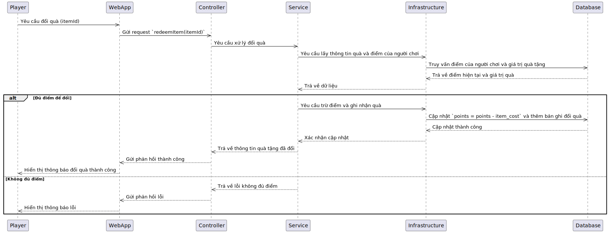

# TÀI LIỆU DỰ ÁN

## UserCase 
<!-- usecase tổng quát sẽ ở đây -->
### Chức năng User
<!-- chức năng của user sẽ thêm vào đây -->
### Chức năng Player

### Chức năng Developer

## Sơ đồ hoạt động (Activity Diagram)

### Sơ đồ hoạt động 

### Quy trình đăng nhập của Player

### Quy trình chơi game và nhận thưởng của Player

### Quy trình đổi thưởng của Player

### Quy trình xem BXH và đánh giá của Player

### Quy trình đăng nhập của Developer

### Quy trình Developer sử dụng asset miễn phí do Designer cung cấp

### Quy trình Developer mua asset có phí từ Designer

### Quy trình Developer đăng ký thông tin game mới và upload file game

### Quy trình Developer khai báo để được cấp API cho leader board

### Quy trình Developer khai báo để được cấp API, SDK, Document cho hệ thống tích điểm đổi quà

### Quy trình Developer khai báo để được cấp API, SDK, Document cho hệ thống nạp tiền vào tài khoản game

### Quy trình Developer quản lý danh sách game của mình (cập nhật, chỉnh sửa, xoá)

### Quy trình Developer quản lý doanh thu từ game (nếu có)

## Sơ đồ luồng xử lý (Sequence Diagram)

### Luồng xử lý đăng nhập của Player

### Luồng xử lý chơi game và nhận thưởng của Player

### Luồng xử lý đổi thưởng của Player

### Luồng xử lý xem BXH và Review của Player

### Luồng xử lý đăng nhập của Developer

### luồng xử lý Developer sử dụng asset miễn phí do Designer cung cấp

### Luồng xử lý Developer mua asset có phí từ Designer

### Luồng xử lý Developer đăng ký thông tin game mới và upload file game

### Luồng xử lý Developer khai báo để được cấp API cho leader board

### Luồng xử lý Developer khai báo để được cấp API, SDK, Document cho hệ thống tích điểm đổi quà

### Luồng xử lý Developer khai báo để được cấp API, SDK, Document cho hệ thống nạp tiền vào tài khoản game

### Luồng xử lý Developer quản lý danh sách game của mình (cập nhật, chỉnh sửa, xoá)

### Luồng xử lý Developer quản lý doanh thu từ game (nếu có)
